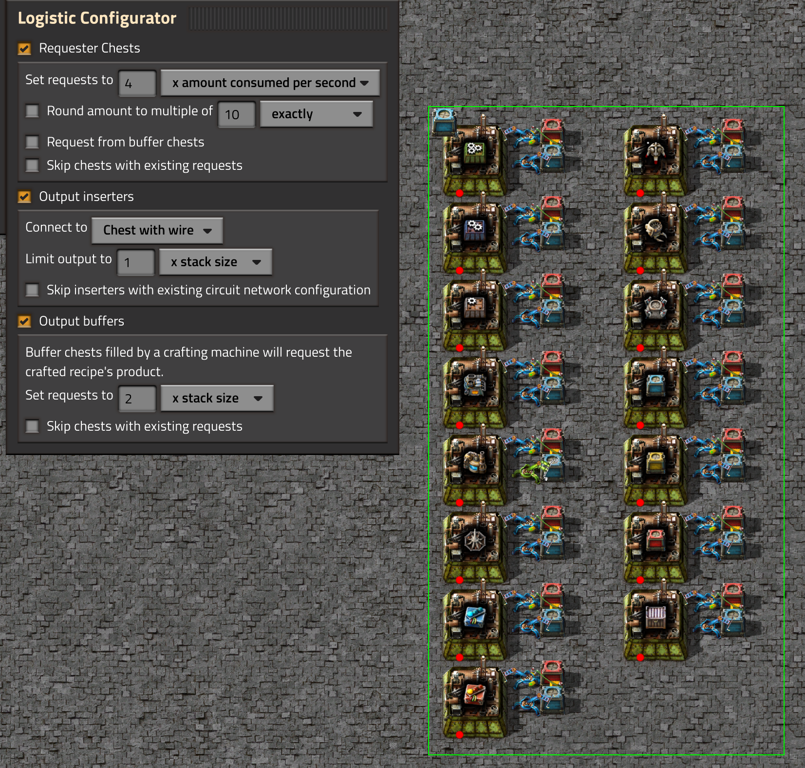
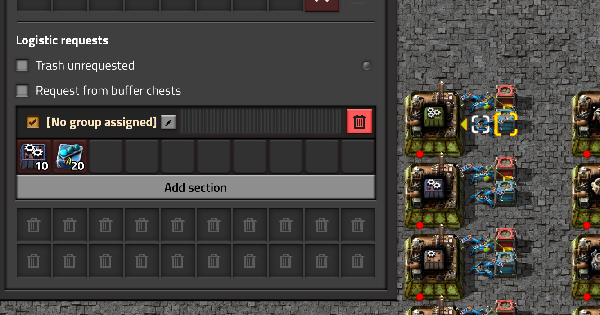
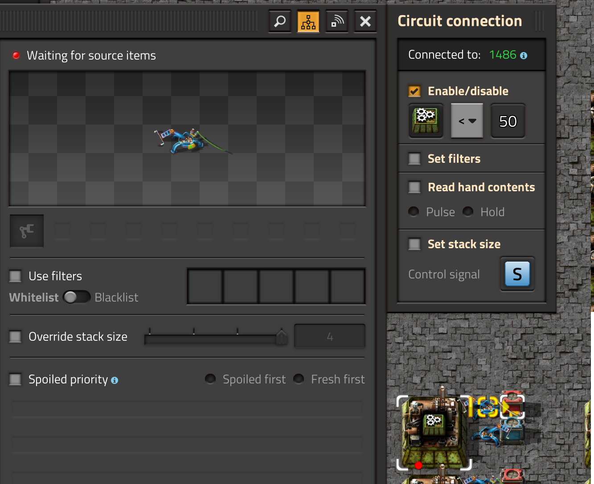
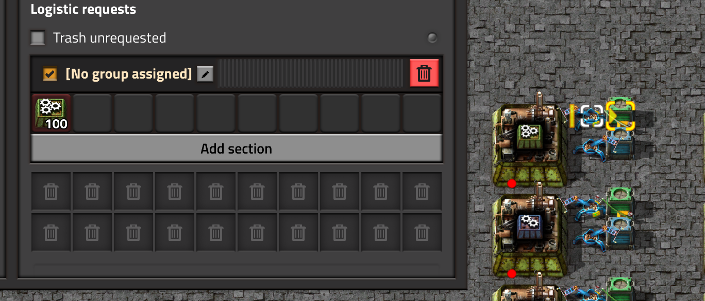

# Factorio LogisticConfigurator

This is a mod for [Factorio](http://factorio.com) useful for mass configuring a
typical bot mall. Quickly and easily set the logistic requests and limit the outputs of every
crafting machine in an area.

# How to use

Set up your crafting machines to be fed from a requester chest, and output to
either a provider chest or buffer chest. Select the `Logistic Configurator` tool
and change the settings to your likings, then select the area including all the
crafting machines and logistic chests. The tool will configure the following things
(each individually optional):
* Requester chests: Any requester chest serving as input to a crafting machine (via
 an inserter) will have its requests set to some multiple of the ingredients needed by the crafting machine.
* Output inserters: Any inserter taking from the crafting machine and dropping into a chest
will be enabled only if the chest (or the logistic network - configurable) contains less than some
amount of the crafter's output.
* Buffer chests: Any buffer chest being fed by a crafting machine (via an insterer) will
request some amount of the crafter's output.